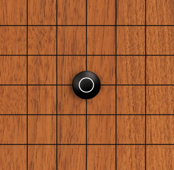
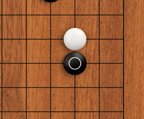
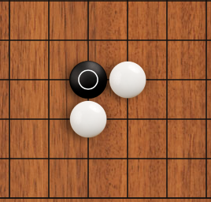
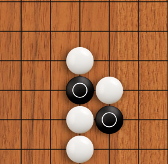

在模型训练方面，我们使用了keras深度学习框架，用tensorflow来作为我们的backend。整体采用卷积神经网络训练，具体为7层的卷积神经网络和2层全连接网络。最后选择使用Django框架来部署我们的项目。因此在前期我们的最主要工作其实是了解卷积神经网络，学习思考围棋AI该怎样实现，以及学习相关算法和tensorflow，Django等框架的使用．  
关于当前的实现，具体一点来讲是这样的：围棋棋盘19*19，棋盘上每一点的状态可以是黑子，也可以是白子，他们分别有多少口气（围棋术语liberty），所以棋盘上每一个点我们有7个状态来表示他们，1，2，3用来表示白子的，4，5，6用来表示黑子的状态，7用来表示劫（围棋术语 ko）。比如1代表白子还剩1口气，2代表白子还剩2口气。3代表白子还剩3口及以上（即4）的气数。同理4，5，6的意思和1，2，3意思差不多。所以我们可以将棋盘数据表示成一个三维向量，维度是（7*19*19）。网络的输出是（19*19），由于目前只用了一个策略网络。所以目前网络的输出会是（19*19）个概率。然后我们选择概率最高的几个点，通过判断这些点是否有效，然后落子。在后期我们计划再训练一个价值网络，争取让我们的模型更加智能。  

由于我们项目的AI模型是通过对KGS上4~6段玩家对弈的棋局训练出来的，而且在测试阶段战胜了腾讯围棋的高级版AI，所以可以在一定程度上保证AI的棋力．在前端部分，暂时只实现了最基础棋盘界面，可以在一定程度上支持多个不同用户与我们的AI进行对弈．而具体功能的完善以及体现学习创新与围棋的结合等部分，将会在后期的工作中逐步实现．  
由于学生项目的条件限制，我们这个项目现阶段的目标并不是训练出一个足够强大到媲美AlphaGo的围棋AI，而是希望在训练出一个相对优秀的围棋AI的基础上，实现一个每个用户都能参与进去的围棋平台．后期，我们会在平台上不断添加各种围棋相关和体现神经网络应用性质的功能，例如：围棋开局时用户有对先后手，不同等级AI的选择，也可让AI进行让先；棋局中用户可实时查看当前棋局战况，正常下棋或者选择过手甚至认输，我们将对用户落子的时限进行设置，超时扣分；棋局结束时会对棋局做出胜负评判，并将得分扣分的详细情况展示给用户．致力于把它做成一个用户友好，交互性强，充满趣味性的平台，同时把神经网络的概念通过围棋向用户进行生动形象的科普，争取做到寓教于乐的目的．  
